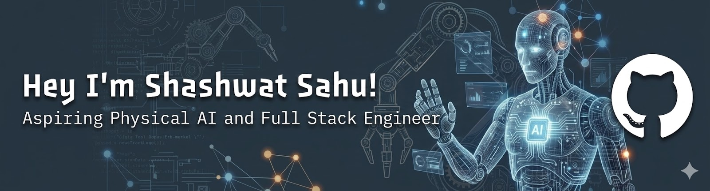

<div align="center">



<br>

<a href="https://git.io/typing-svg"></a>

<br><br>

<p align="center">
  <!-- LinkedIn -->
  <a href="https://linkedin.com/in/shashwatsahu21">
    <picture>
      <source media="(prefers-color-scheme: dark)" srcset="https://readmecodegen.vercel.app/api/social-icon?name=linkedin&size=60&theme=dark" />
      
    </picture>
  </a>&nbsp;&nbsp;

  <!-- GitHub -->
  <a href="https://github.com/ShashwatSahu21">
    <picture>
      <source media="(prefers-color-scheme: dark)" srcset="https://readmecodegen.vercel.app/api/social-icon?name=github&size=60&theme=dark" />
      
    </picture>
  </a>&nbsp;&nbsp;

  <!-- Email -->
  <a href="mailto:shashwatsahu2103@gmail.com">
    <picture>
      <source media="(prefers-color-scheme: dark)" srcset="https://readmecodegen.vercel.app/api/social-icon?name=gmail&size=60&theme=dark" />
      
    </picture>
  </a>
</p>

📍 Bengaluru, India &nbsp;&nbsp;&nbsp; | &nbsp;&nbsp;&nbsp;  &nbsp;&nbsp;&nbsp; | &nbsp;&nbsp;&nbsp; 📧 shashwatsahu2103@gmail.com

</div>

---

<!-- About Me -->
<p align="center">
  
</p>

```csharp
System.Profile ver. 6.0.1:
----------------------------------------------------------------------------------------
Username:            Shashwat Sahu
WhoAmI:              Robotics Engineer | Physical AI | Developer
Shell:               bash / zsh
Editor:              VS Code
Pronouns:            He/Him
Location:            Bengaluru, India

Languages:           Python, C++, C, Embedded C, JavaScript
Core.Domains:        Physical AI · Embedded ML · Robotic Manipulation · Signal Processing
Learning:            Advanced ROS2 · Sim-to-Real Transfer · Reinforcement Learning for Robotics · Neural Networks  

Special.Interests:
    EMG/EEG Signal Processing · Bio-Robotics · Industrial Automation
    Computer Vision · SLAM · Inverse Kinematics · 3D Printing

Education:           BE, Robotics & Artificial Intelligence
                     Bangalore Institute of Technology (2023 – 2027)

```

---

<!-- Tech Stack -->
<p align="center">
  
</p>

| [](https://git.io/typing-svg) | [](https://git.io/typing-svg) |
|:---:|:---:|
| <p align="center"><strong>🧠 Machine Learning & AI</strong><br> &nbsp;<br>PyTorch · TensorFlow · OpenCV · YOLO · Hugging Face · Gen-AI</p><br><p align="center"><strong>🤖 Robotics and Physical AI</strong><br><br>ROS2 · Gazebo · RViz · Isaac Sim · PyBullet · Webots<br>Imitation Learning · Arduino · Raspberry Pi</p><br><p align="center"><strong>💻 Programming</strong><br><br>Python · C++ · C · Embedded C · JavaScript</p> | <p align="center"><strong>🛠️ Tools & Platforms</strong><br><br>Git · GitHub · VS Code · Jupyter · Anaconda</p><br><p align="center"><strong>🌐 Web & Data</strong><br><br>HTML/CSS · MySQL · React · FastAPI</p><br><p align="center"><strong>🎨 Design & Simulation</strong><br> &nbsp;<br>Fusion 360 · Autodesk · Ansys · PyBullet<br>Webots · 3D Printing</p> |

---

<!-- Stats -->
<p align="center">
  
</p>

<br>

<div align="center">
  
</div>

---

<!-- Experience -->
<p align="center">
  
</p>

> 🔹 **AI & Robotics Operations Manager Intern**
> &nbsp;&nbsp;&nbsp;&nbsp;*Incanto Dynamics Pvt. Ltd.* &nbsp;|&nbsp; `Jan 2026 – Present`
> &nbsp;&nbsp;&nbsp;&nbsp;↳ *Leading on-ground deployment, testing, and integration of industrial robotic systems and AI-driven operations within active factory environments.*
>
> <br>
>
> 🔹 **Artificial Intelligence Intern**
> &nbsp;&nbsp;&nbsp;&nbsp;*1Stop.ai* &nbsp;|&nbsp; `Apr 2024 – Jun 2024`
> &nbsp;&nbsp;&nbsp;&nbsp;↳ *Trained, evaluated, and benchmarked machine learning models, integrating AI features into production workflows via API endpoints.*
>
> <br>
>
> 🔹 **Club Operations Lead & Technical Team Manager**
> &nbsp;&nbsp;&nbsp;&nbsp;*Robotics Cell, BIT* &nbsp;|&nbsp; `Jan 2024 – Jan 2025`
> &nbsp;&nbsp;&nbsp;&nbsp;↳ *Directed student robotics teams through physical bot build cycles, managed hackathon participations, and mentored juniors on embedded systems.*


---

<!-- Projects -->
<p align="center">
  
</p>

### 🦾 [SynaptIArm-6X](https://github.com/ShashwatSahu21/synapticx-6x): Neural-Augmented 6-DOF Robotic Manipulator
`Physical AI` &nbsp;•&nbsp; `EMG/EEG` &nbsp;•&nbsp; `Embedded ML`

*   **Neural Interpretation:** Engineered neural augmentation for robotic manipulation through bio-electrical signals (EMG/EEG) with ML-based real-time interpretation.
*   **High Performance:** Achieved 94% intent-detection accuracy with `<30ms` inference latency.
*   **Signal Processing:** Implemented Band-pass + Notch filtering, RMS, MAV, and ZCR feature extraction.
*   **Physical Automation:** Developed Arduino servo-control via serial communication for autonomous pick-and-place with a 3D-printed full 6-DOF assembly using inverse kinematics.
*   **Links:** [](https://github.com/ShashwatSahu21/synapticx-6x)

<br>

### 💰 [Finity](https://github.com/ShashwatSahu21/Finity-) — Premium AI Financial Companion
`FinTech` &nbsp;•&nbsp; `AI Guidance` &nbsp;•&nbsp; `Wealth Projection`

*   **Production-Grade Platform:** Designed a financial platform with a minimalist, Notion-inspired user interface.
*   **AI Financial Coach:** Provides context-aware guidance on Indian taxation, investments, and budgeting.
*   **Advanced Simulation:** Built an investment simulator with probabilistic Monte Carlo visualizations.
*   **Smart Budgeting:** Features a 50/30/20 budget framework with automated expense categorization.
*   **Tech Stack:** React 18 · FastAPI · Scikit-learn · Framer Motion.
*   **Links:** [](https://github.com/ShashwatSahu21/Finity-)

<br>

### 🦅 [RAVR](https://github.com/ShashwatSahu21/RAVR-) — Hyperlocal Cultural Radar
`Event Discovery` &nbsp;•&nbsp; `Real-time Maps` &nbsp;•&nbsp; `UX Design`

*   **Urban Culture Radar:** A "Spotify for events" platform centered on urban culture and nightlife in Bangalore with interactive city radar maps.
*   **Real-Time Sync:** Features Supabase-powered real-time synchronization and custom "Vibe Match" scoring.
*   **Premium UX:** Implemented a high-impact UI with magnetic navigation and custom cursor trails.
*   **Tech Stack:** Next.js 16 (App Router) · React 19 · Supabase · Leaflet.
*   **Links:** [](https://github.com/ShashwatSahu21/RAVR-) &nbsp; [](https://ravr.vercel.app)


---

<!-- Contributions -->
<p align="center">
  
</p>

<div align="center">
  <picture>
    <source media="(prefers-color-scheme: dark)" srcset="https://raw.githubusercontent.com/ShashwatSahu21/ShashwatSahu21/output/github-contribution-grid-snake-dark.svg" />
    <source media="(prefers-color-scheme: light)" srcset="https://raw.githubusercontent.com/ShashwatSahu21/ShashwatSahu21/output/github-contribution-grid-snake.svg" />
    
  </picture>
</div>

---

<!-- Education -->
<p align="center">
  
</p>

| [](https://git.io/typing-svg) | [](https://git.io/typing-svg) | [](https://git.io/typing-svg) |
|:---:|:---:|:--- |
| **BE, Robotics & Artificial Intelligence** | [Bangalore Institute of Technology](https://www.bit-bangalore.edu.in/), Bengaluru<br>2023 – 2027 | • Affiliated to [VTU](https://vtu.ac.in/) (Visvesvaraya Technological University)<br>• Approved by [AICTE](https://www.aicte-india.org/) & Accredited by [NBA](https://www.nbaind.org/) (Tier-I / Washington Accord Signatory)<br>• **Equivalency:** Equivalent to a 4-Year [B.S. in Engineering](https://en.wikipedia.org/wiki/Bachelor_of_Science_in_Engineering) (US/Canada) and [B.Eng. Honours](https://en.wikipedia.org/wiki/Bachelor_of_Engineering) (UK/Europe/Australia) |
| **Senior Secondary (K-12) — PCM** | [Campion School](https://en.wikipedia.org/wiki/Campion_School,_Bhopal), Bhopal<br>2020 – 2022 | • **Jesuit Institution** (Society of Jesus) — Globally recognized for academic excellence<br>• [CBSE](https://www.cbse.gov.in/) Affiliated \| Equivalence to [UK A-Levels](https://en.wikipedia.org/wiki/GCE_Advanced_Level), [US Diploma](https://en.wikipedia.org/wiki/High_school_diploma), & [Japan Upper Secondary](https://en.wikipedia.org/wiki/Secondary_education_in_Japan)<br>• Strong Global Alumni Network (COBA) |

---

<!-- Achievements -->
<p align="center">
  
</p>

```csharp
Achievements.Log ver. 6.0.5:
----------------------------------------------------------------------------------------

🏆 Awards:
    → Student Innovator of the Year — NITI Aayog ATL Labs
      Recognized for outstanding innovation in AI & Robotics

    → Governor of Madhya Pradesh Award
      Awarded for outstanding performance, discipline, and consistent excellence

📜 Certifications:
    → Crash Course on Python — Google
    → ROBOAI 45-Day Training and Internship Program
    → Data Analytics & Visualization — Accenture
    → Python for Data Science & ML — Meta Brains
    → Generative AI — Google Jams
    → Robotics Automation & Software Simulation — My Equation
    → NODEMCU — Samsung
```

---

<div align="center">


</div>
